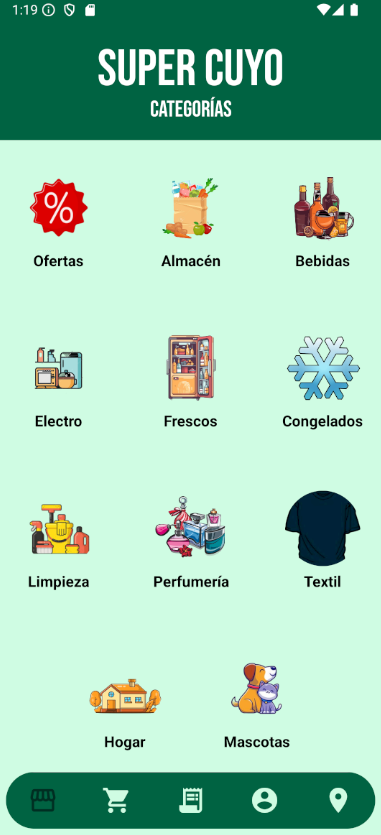
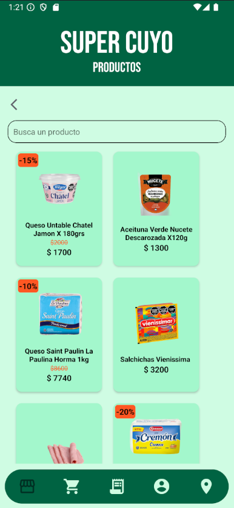
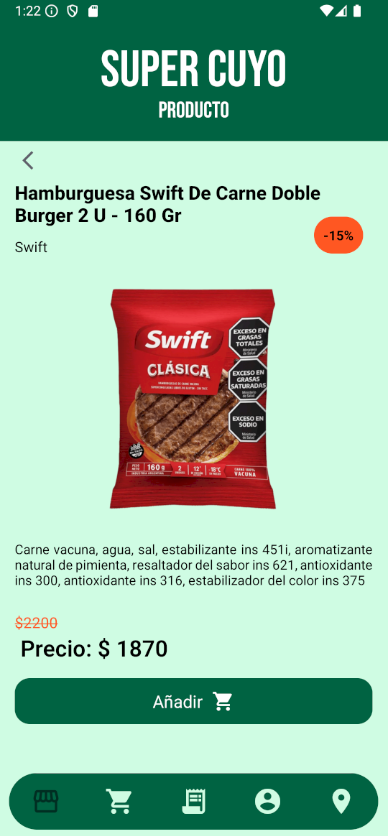
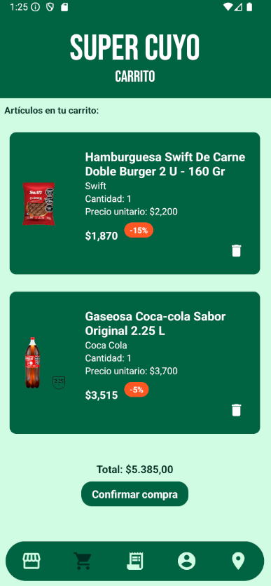
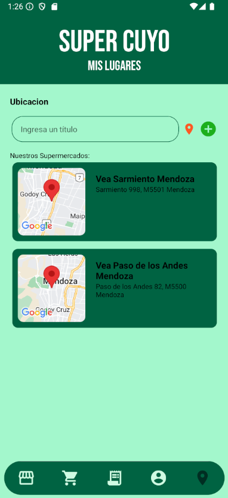

# Desarrollo de Aplicaciones Coder

## Descripción

Super Cuyo es una aplicación de e-commerce diseñada para simular la experiencia de compra en un supermercado. La app permite a los usuarios explorar productos, gestionar un carrito de compras y realizar pedidos de manera sencilla.

Desarrollada con React Native y Expo, cuenta con funciones como registro e inicio de sesión, categorización de productos, búsqueda por nombre y más. Además, utiliza SQLite para el almacenamiento local y Firebase para la autenticación y gestión de datos en tiempo real.

## Características Principales 
- **Catálogo de Productos**: Explora una lista de productos clasificados por categorías para una búsqueda más organizada.
- **Búsqueda de Productos por Nombre**: Encuentra rápidamente los productos que necesitas ingresando su nombre.
- **Autenticación Segura**: Registro e inicio de sesión gestionados con Firebase Authentication, garantizando la protección de las credenciales de los usuarios.
- **Carrito de Compras Interactivo**: Añade y elimina productos del carrito con facilidad y confirma tus compras con un proceso intuitivo.
- **Almacenamiento Local**: Utiliza SQLite para guardar información de manera local, asegurando la funcionalidad sin conexión a internet.
- **Uso de Cámara y Ubicación**: Permite a los usuarios capturar imágenes para elegir una foto de perfil y guardar su dirección utilizando la ubicación del dispositivo.


## Instalación

### Requisitos Previos

- Node.js
- npm 
- Expo (SDK 51)
- Adroid Studio

### Pasos de Instalación

1. Clona el repositorio:

    ```bash
    git clone https://github.com/gonzalovmm/DesarrolloApp
    cd DesarrolloApp
    ```

2. Instala las dependencias:

    ```bash
    npm install
    ```

3. Inicia el proyecto con Expo:

    ```bash
    npx expo start
    ```

## Capturas de Pantalla 
Se muestra el funcionamiento de la aplicación: 
### Pantallas de inicio


### Aplicación







## Autor
 
Gonzalo Van Megroot

